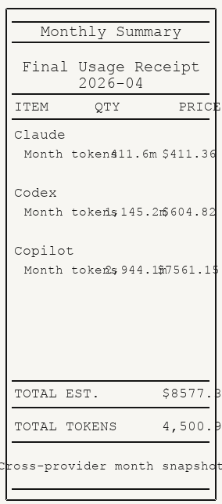

# cli-receipt

Local-first monthly usage receipts for Claude Code, OpenAI Codex, and GitHub Copilot.

It reads the local artifacts those tools already write on your machine, estimates token usage and cost, and renders:

- terminal receipts
- HTML heatmaps
- JSON reports

No external service is required to run the report. Node.js `>= 20` is enough.

## Sample Output



## What This Project Is

`cli-receipt` is a small Node CLI with no runtime dependencies.

It reads:

- Claude Code logs from `~/.claude`
- Codex logs from `~/.codex`
- Copilot session data from `~/.copilot/session-state`

It does not call provider billing APIs for the main report. Costs are estimated from local token artifacts and public pricing tables.

## Fastest Start

### Option 1. Run it directly with `node`

This is the easiest path when you cloned the repo locally and have not published anything yet.

```bash
git clone https://github.com/lidge-jun/cli-receipt.git
cd cli-receipt
node bin/agent-usage.js report
```

Generate HTML and JSON files:

```bash
node bin/agent-usage.js report --output html,json
```

By default those files are written to `./output` relative to the directory where you run the command.

### Option 2. Link it as a local command

If you want to use `cli-receipt` like a global CLI during development:

```bash
git clone https://github.com/lidge-jun/cli-receipt.git
cd cli-receipt
npm link
cli-receipt report
```

### Option 3. Run without cloning

If the package is published to npm later, this also works:

```bash
npx cli-receipt report
```

## Real Examples

Current month, all providers:

```bash
node bin/agent-usage.js report
```

Last 30 days, Claude only:

```bash
node bin/agent-usage.js report --provider claude --window last30
```

Specific month:

```bash
node bin/agent-usage.js report --month 2026-03
```

Write HTML and JSON to a custom directory:

```bash
node bin/agent-usage.js report --output html,json --outdir ./reports
```

Use only Codex data from a custom root:

```bash
node bin/agent-usage.js report --provider codex --codex-root ~/.codex
```

## Claude Hook Setup

You can automatically generate a report at the end of every Claude Code session.

Install the hook:

```bash
node bin/agent-usage.js install-claude-hook
```

Install the hook for only Claude and Codex:

```bash
node bin/agent-usage.js install-claude-hook --provider claude,codex
```

Remove the hook:

```bash
node bin/agent-usage.js uninstall-claude-hook
```

What it does:

- updates `~/.claude/settings.json` by default
- adds a `SessionEnd` hook
- runs `node "<repo>/bin/agent-usage.js" refresh --provider ... --output html,json`

You can override the settings file path:

```bash
node bin/agent-usage.js install-claude-hook --settings /path/to/settings.json
```

## CLI Reference

Main command:

```bash
cli-receipt report [options]
```

Options:

| Option | Default | Description |
|---|---|---|
| `--provider <list>` | `auto` | Comma-separated: `claude`, `codex`, `copilot`, or `auto` |
| `--window <type>` | `month` | `month` or `last30` |
| `--month <YYYY-MM>` | `current` | Target month, for example `2026-03` |
| `--output <list>` | `terminal` | Comma-separated: `terminal`, `html`, `json` |
| `--outdir <path>` | `./output` | Output directory for HTML and JSON files |
| `--copilot-token-file <path>` | none | Explicit token file for Copilot quota snapshot |
| `--claude-root <path>` | `~/.claude` | Override Claude data root |
| `--codex-root <path>` | `~/.codex` | Override Codex data root |
| `--copilot-root <path>` | `~/.copilot/session-state` | Override Copilot data root |
| `--settings <path>` | `~/.claude/settings.json` | Settings path used by Claude hook install |

Global flags:

```bash
cli-receipt --help
cli-receipt --version
```

## How It Works

```text
~/.claude/projects/**/*.jsonl   -> Claude provider  -+
~/.codex/sessions/**/*.jsonl    -> Codex provider   -+-> aggregate -> render
~/.copilot/session-state/*      -> Copilot provider -+
```

Each provider extracts model metadata and token counts from local files, estimates pricing with a built-in pricing table, and then feeds a single reporting pipeline.

## Pricing Notes

Pricing is estimated from public API pricing and local token artifacts.

- It is not an authoritative billing source.
- Claude, Codex, and Copilot totals stay separated by provider.
- Codex daily totals are based on `token_count` event deltas.
- Claude `-fast` aliases are normalized for pricing.
- Copilot quota snapshots need `--copilot-token-file` when you want quota data.
- Small rounding differences are normal.

## Development

Run tests:

```bash
node --test
```

Show help:

```bash
node bin/agent-usage.js --help
```

## License

[MIT](./LICENSE)
